<h1 align="center">FESTAI</h1>

  <b>AI·ESG 기반 지역축제 운영과 방문객 경험을 하나의 플랫폼으로 연결합니다</b> 
  AI 안내 · QR 모바일 웹 · 통합 운영 · ESG 성과관리 · 참여업체 콘솔을 제공하는 풀스택 팀 프로젝트

  
  
  
  
  
  

  <a href="https://github.com/FEST-ON/Frontend">Frontend</a> /
  <a href="https://github.com/FEST-ON/Backend">Backend</a> /
  <a href="https://backend-production-8532.up.railway.app/docs">API 문서</a>

---

## 프로젝트 소개 · 핵심 기능

  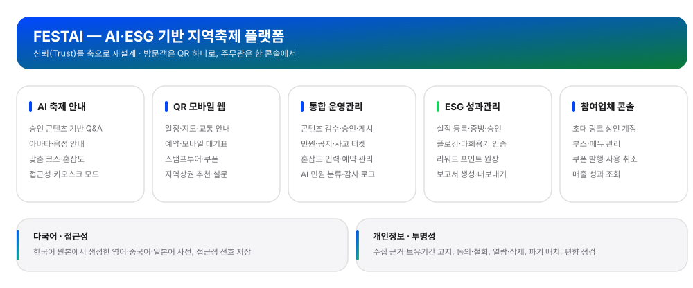

## 시스템 아키텍처

  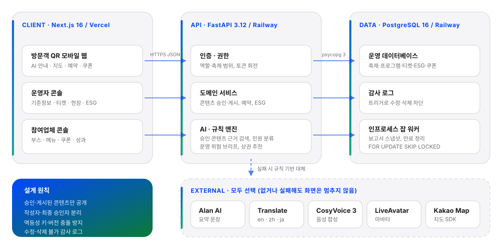

### 아키텍처 선택 이유

- 클라이언트는 역할별로 나누고, API는 하나로 두어 권한 정책을 한 곳에서 통제합니다.
- 방문객 웹은 첫 화면 속도가 중요해 Next.js, AI·데이터 처리는 파이썬 생태계가 필요해 FastAPI를 썼습니다.
- 축제 단위 트래픽에는 PostgreSQL 한 대면 충분해, 잡 큐도 DB 안에서 처리합니다.
- 감사 로그는 DB 트리거로 막아 어떤 경로로 들어와도 수정·삭제되지 않습니다.
- 외부 AI는 모두 선택 사항이라, 장애가 나도 규칙 기반으로 대체되고 현장은 멈추지 않습니다.

## 웹 화면

### 방문객 모바일 웹

QR 하나로 들어와 로그인 없이 쓰는 화면입니다.

| 홈 | AI 안내 | 스탬프투어 | 예약·대기표 |
|---|---|---|---|
| 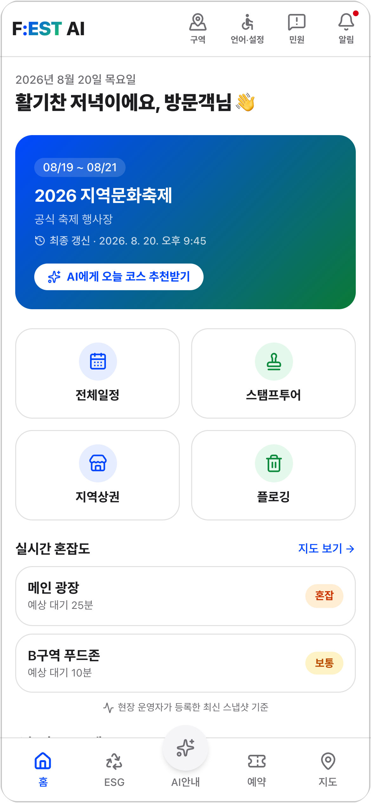 | 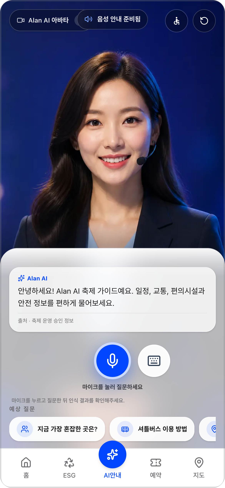 | 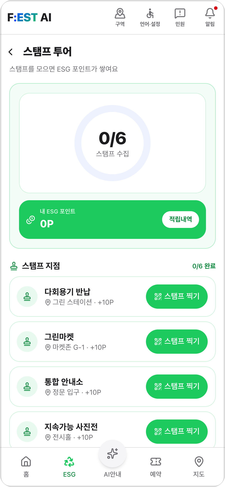 | 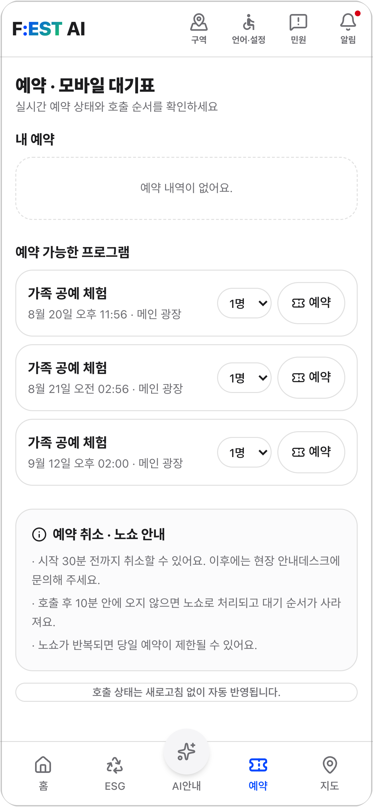 |
| 축제 요약·실시간 혼잡도 | 아바타·음성 Q&A, 승인 정보만 인용 | QR 스탬프 적립·ESG 포인트 | 회차 예약과 모바일 대기표 |

### 운영자 콘솔

주무관이 한 콘솔에서 현장·민원·성과를 봅니다.

| 운영 대시보드 | AI 민원 인사이트 | ESG 성과관리 | 인원 예측 |
|---|---|---|---|
| 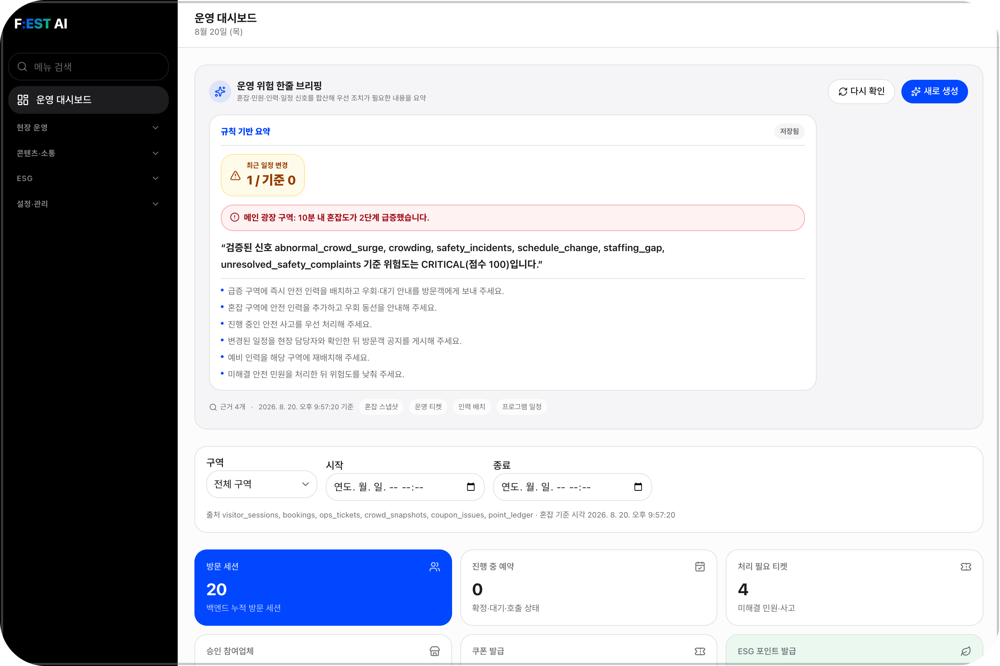 | 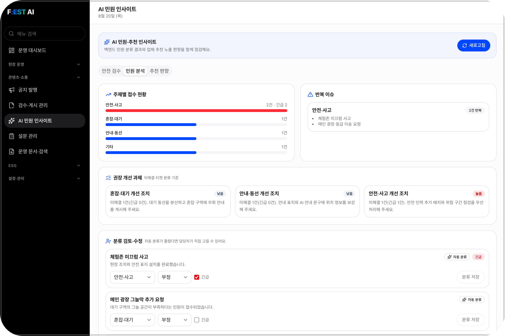 | 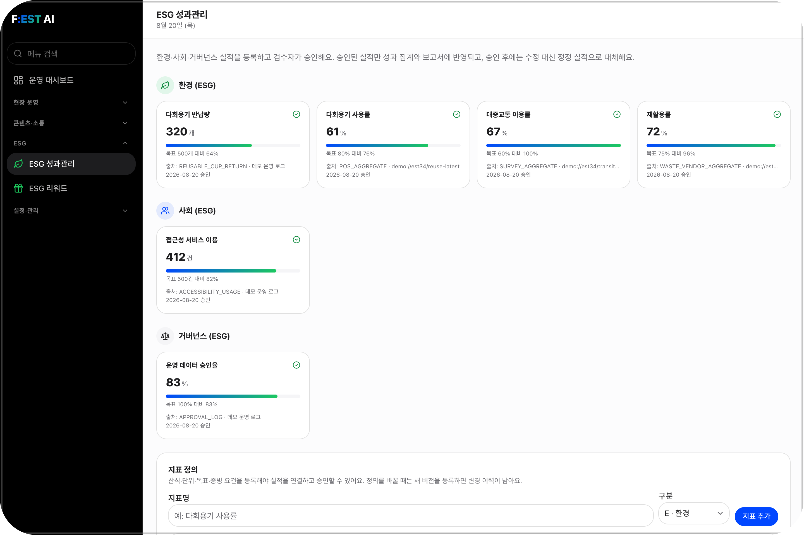 | 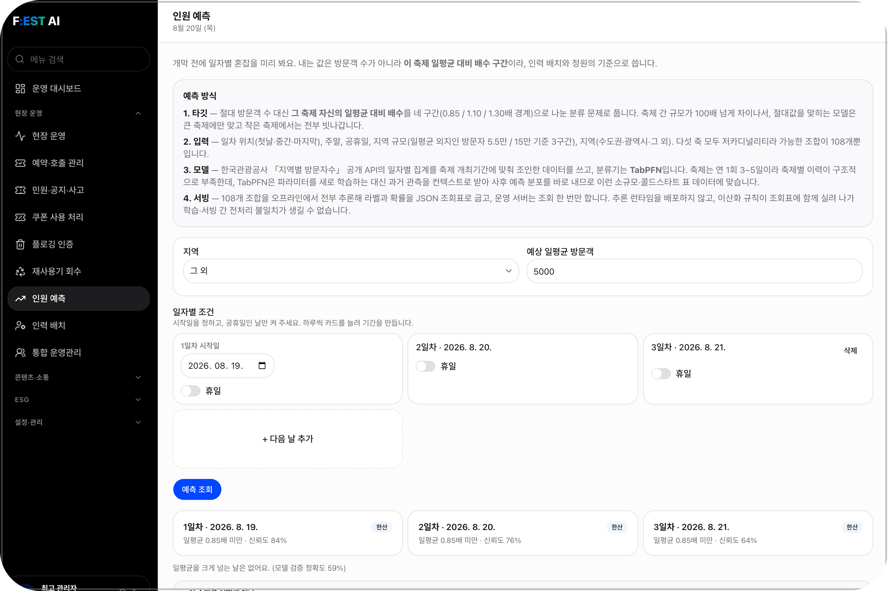 |
| 규칙 기반 위험 브리핑과 근거 | 민원 자동 분류·반복 이슈·권장 조치 | E·S·G 지표별 승인 실적과 출처 | TabPFN 일자별 혼잡 구간 예측 |

### 참여업체 · 현장 · 신뢰

| 참여업체 콘솔 | 참여업체 심사·쿠폰 | 현장 운영 | 감사 로그 |
|---|---|---|---|
| 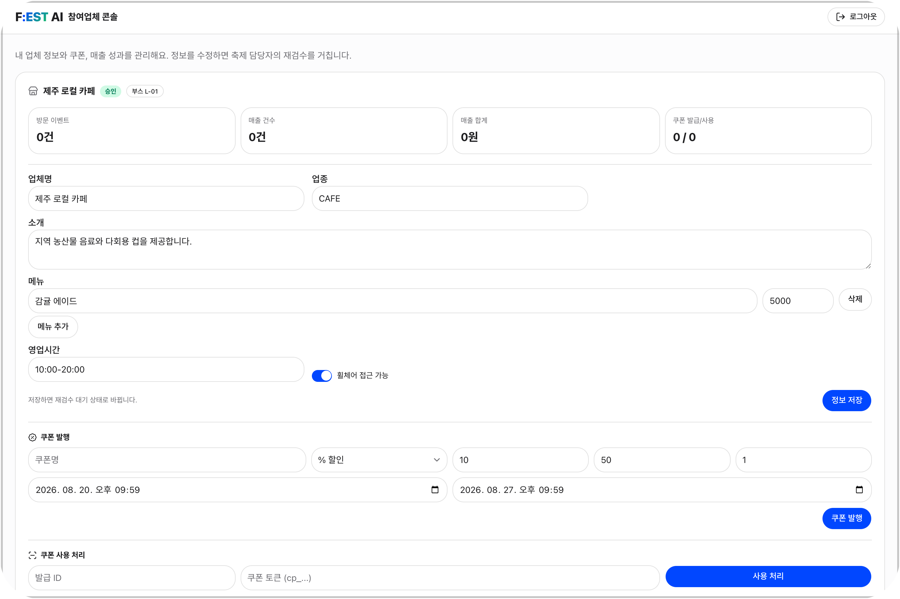 | 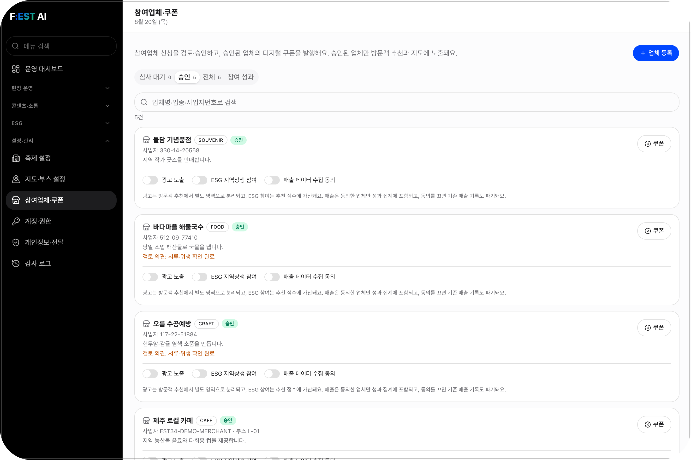 | 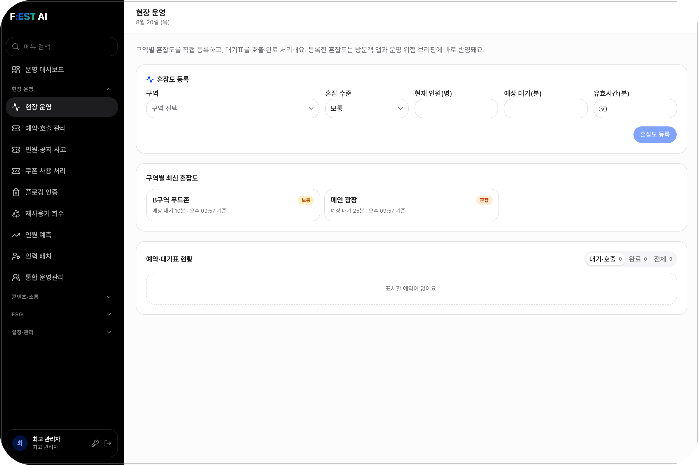 | 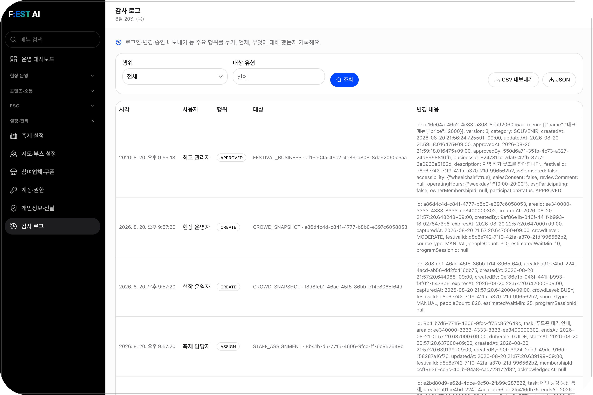 |
| 상인이 직접 쓰는 부스·메뉴·쿠폰 | 신청 검토·승인·반려와 쿠폰 발행 | 혼잡도 등록과 대기표 호출 | 누가·언제·무엇을, 수정·삭제 불가 |

> 화면은 로컬 데모 데이터(`scripts.seed` + 데모 보강)로 캡처했습니다.

## 팀 구성

<table>
  <tr><td align="center"></td><td><b>강덕현</b> 프론트엔드</td><td>AI 안내·키오스크 경험</td></tr>
  <tr><td align="center"></td><td><b>김나영</b> 백엔드</td><td>AI 컨텍스트 연동과 공개 데이터 API</td></tr>
  <tr><td align="center"></td><td><b>서하니</b> 기획</td><td>서비스 기획과 문서·발표</td></tr>
  <tr><td align="center"></td><td><b>심주혜</b> 프론트엔드</td><td>방문객·운영자 화면과 다국어</td></tr>
  <tr><td align="center"></td><td><b>정상겸</b> 풀스택</td><td>백엔드 설계·구축, 프론트 연동, 배포</td></tr>
</table>
